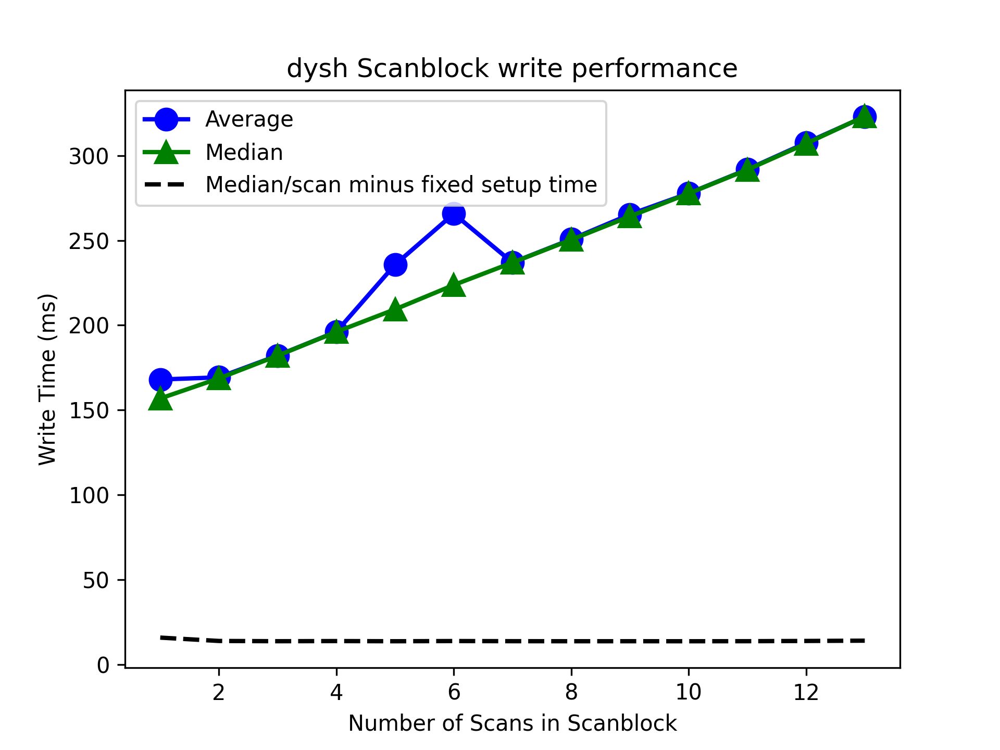

# Benchmark outputs for Q8

These files were created with runbenchq8.sh
Setting OMP_NUM_THREADS=1 to ensure no interference from the GIL.
They contain the benchmark table and first 50 lines of profiler output.
Profiler stats are sorted by CUMULATIVE time. Files with ".time" extension are sorted by TOTAL time.

## Profiler results for GBTFITSLOAD
These are the top CPU using methods as listed by the profiler

### with flags
  
   - Selection._check_for_duplicates
     - this method checks that a selection rule (DataFrame) does not create an indentical DataFrame to an existing selection rule.   It uses DataFrame.equals().   Because every flag rule is stored as a DataFrame, this is called N-1 times for the Nth flag rule.   There may be savings available by finding abetter way to compare DataFrames (e.g. assert_frame_equals which compares column by column or some more clever way)
 - Selection._addrow
    - This calls astropy Table.add_row which can be expensive. There may be a better way to build the "flag/selection summary table" other than row by row when we know we will be reading in multiple rows of flags.
- Selection._add_utc_column 
    - We add the UTC column so that users can easily select data by time using a Time object. 
    - Despite using the "array version" of astropy Time instantiation, this call is still expensive when the number of rows is large.   Pandas supported np.datetime64, which may be a better way to store this column.   And just do a conversion of the user's desired time range to datetime64
   - Time spent in millions of calls to astropy Table functions
 

### without flags

- Selection._add_utc_column 
     - see above. Note for some reason this method is called 8 time regardless of how many files are loaded.  (Same for with flags)

- Various astropy and pandas methods. Some astropy methods appear to be related to initial manipulation of the binary table (drop_fields) when creating the index.  
 
## Profiler results for GETPS

These are the top CPU using methods as listed by the profiler, not including loading the SDFITS file.
Basic result: Creating Spectrum objects is expensive.  This may be due to creating WCS under the hood. We would have to perf test Spectrum itself for more info.

## without timeaverage

- exposure() called from calibrate(). Unnecessarily called N times to access elements i thru N.  See issue.  6ms/call but called 352 times.

- astropy fitsrec and column accessors - ~10 ms/call but ~200 calls

- sdfitsload.rawspectra  - 25 ms/call

- perhaps scan._add_calibration_meta could be improved - 68 ms/call

## with timeaverage

- ScanBase.timeaverage - 230 ms/call - includes one call to Spectrum constructor

- Spectrum.make_spectrum (Spectrum/Spectrum1D constructor) - 200 ms/call

- called to scan.calibrated (which creates a Spectrum object) - 200 ms/call

- astropy/wcs/wcsapi/high_level_api.py - called during Spectrum construction (by Spectrum1D) - 164 ms/call

## Profiler results for Scanblock write!

The test does a getps on 13 scans then writes the scanblock with from 1 to 13 PSScans.  The result is linear with number of scans 
with an average of about 13 ms per scan plus a one-time fixed set up time of 140 ms.  This is perfectly reasonable and does not
need improvement.  A plot of the results

## Profiler results for OTF (getsigref)

Input file is abut 2.3GB, but the OTF is obtained from a subset of this, 13 ON scans, and one OFF scan, using getsigref(),
on a single feed, IF (there are 5 in total) and pol (2 in total). The default mode in the benchmark extract these limited scans into a smaller
(5MB) sdfits file., which is processed in about 19sec, whereas processing them directly from the big file takes about 116 sec. This is by
far the largest impact on performance. The cost of writing (and reloading) that 5MB file is about 3 sec.
