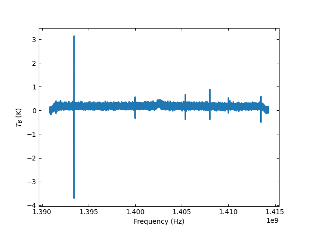

**********************
Position-Switched Data
**********************

Calibrating Position-Switched Data
==================================

Single beam position-switched (PS) data is retrieved using :meth:`~GBTFITSLoad.getps` which returns a `~GBTPSScan` position-switched scan object that is used to calibrate and average the data.  First, import the relevant modules::

    >>> from dysh.fits.gbtfitsload import GBTFITSLoad
    >>> from dysh.spectra.scan import GBTPSScan

Then load your SDFITS file containing PS data
(TODO need to replace fixed path with get_example_data() and explanation thereof)::

    >>> f = '/data/gbt/examples/onoff-L/data/TGBT21A_501_11.raw.vegas.fits'
    >>> sdfits = GBTFITSLoad(f)

The returned `sdfits` can be probed for information::

    >>> sdfits.info()
        Filename: /data/gbt/examples/onoff-L/data/TGBT21A_501_11.raw.vegas.fits
        No.    Name      Ver    Type      Cards   Dimensions   Format
          0  PRIMARY       1 PrimaryHDU      12   ()      
          1  SINGLE DISH    1 BinTableHDU    245   6040R x 74C   ['32A', '1D', '22A', '1D', '1D', '1D', '32768E', '16A', '6A', '8A', '1D', '1D', '1D', '4A', '1D', '4A', '1D', '1I', '32A', '32A', '1J', '32A', '16A', '1E', '8A', '1D', '1D', '1D', '1D', '1D', '1D', '1D', '1D', '1D', '1D', '1D', '1D', '8A', '1D', '1D', '12A', '1I', '1I', '1D', '1D', '1I', '1A', '1I', '1I', '16A', '16A', '1J', '1J', '22A', '1D', '1D', '1I', '1A', '1D', '1E', '1D', '1D', '1D', '1D', '1D', '1A', '1A', '8A', '1E', '1E', '16A', '1I', '1I', '1I']   

You can also print a concise (or verbose if you choose) summary :meth:`GBTFITSLoad.summary` of the data::

    >>> sdfits.summary()
        SCAN   OBJECT VELOCITY   PROC PROCSEQN  RESTFREQ   DOPFREQ # IF # POL # INT # FEED     AZIMUTH   ELEVATIO
    0  152.0  NGC2415   3784.0  OnOff      1.0  1.617185  1.420406    5     2   151      1  286.218008   41.62843
    1  153.0  NGC2415   3784.0  OnOff      2.0  1.617185  1.420406    5     2   151      1  286.886521  41.118134

Retrieve a scan and its partner ON or OFF, selecting and IF number and polarization, then calibrate it::

    >>> psscan = sdfits.getps(152, ifnum=0, plnum=0)
    >>> psscan.calibrate() # this will be eventually be subsumed into `calibrate=True` in `getps`
        PSSCAN nrows = 302
    

The system temperature array (numpy.ndarray) is stored in `tsys`::

    >>> print(f"T_sys = {pscan.tsys.mean():.2f}:")
        T_sys = 17.17

To time average the data, using system temperature weighting (other option is 'equal' weighting; 'tsys' is the default if no `weights` parameter is given. The returned object is ~spectra.Spectrum, which has a default matplotlib plotter attached::

    >>> ta = psscan.timeaverage(weights='tsys')
    >>> ta.plot()

 
