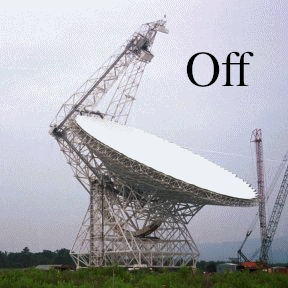
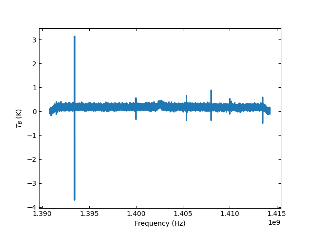
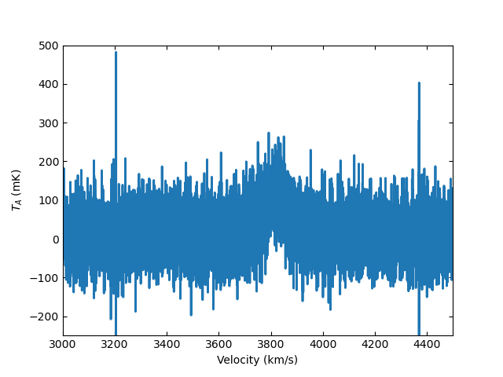

**********************
Position-Switched Data
**********************

Background
==========

Position-switched observations are those in which the telescope observes a target (the ON position or signal) and another part of the sky, assumed to be devoid of emission (the OFF position or reference).

While observing this is accomplished using the functions `OnOff` or `OffOn` in a scheduling block. For more details about these functions see Sections |gbtog_onoff_link| and |gbtog_offon_link| of the |gbtog_link|.

.. |gbtog_onoff_link| raw:: html

   <a href="http://www.gb.nrao.edu/scienceDocs/GBTog.pdf#nameddest=subsubsection.6.4.2.2" target="_blank">6.4.2.2</a>

.. |gbtog_offon_link| raw:: html

   <a href="http://www.gb.nrao.edu/scienceDocs/GBTog.pdf#nameddest=subsubsection.6.4.2.3" target="_blank">6.4.2.3</a>

.. |gbtog_link| raw:: html

   <a href="http://www.gb.nrao.edu/scienceDocs/GBTog.pdf" target="_blank">GBT observer's guide</a>

A modified version of the scheduling block for the observations used in this example is copied below

.. code:: python

    # Observing script for NGC 2415

    # GBT Observing: TGBT21A_501
    # Total power position switch, L-band, VEGAS
    # Targets the HI 21 cm line and the four 18 cm OH lines.

    # Setup configuration
    HI_OH_config ='''
    receiver   = 'Rcvr1_2'
    obstype    = 'Spectroscopy'
    backend    = 'VEGAS'
    restfreq   = 1420.4057517,1612.231,1665.4018,1667.3590,1720.5299
    nwin       = 5
    bandwidth  = 23.44
    nchan      = 32768
    swmode     = 'tp'
    swtype     = 'none'
    swper      = 1.0
    tint       = 2
    vframe     = 'bary'
    vdef       = 'Optical'
    noisecal   = 'lo'
    pol        = 'Linear'
    '''

    # Setup catalog of calibrators.
    Catalog('fluxcal')

    # Define catalog of targets.
    target_cat = """
    format=spherical
    coordmode=J2000
    HEAD=NAME RA DEC
    NGC2415 07:36:56.66 +35:14:30.55
    """
    Catalog(target_cat)

    # Slew to target.
    Slew('NGC2415')

    # Start finding pointing and focus corrections.i
    # Without argument AutoPeakFocus will try to find
    # a suitable pointing calibrator.
    AutoPeakFocus()

    # After an Auto procedure it is necessary to reconfigure.
    Configure(HI_OH_config)

    # Slew to the target and adjust the power levels.
    Slew('NGC2415')
    Balance()

    # Observe a source of known flux density to find the
    # equivalent temperature/flux of the noise diode.
    # This will be used to calibrate the flux scale.
    OnOff('3C196', Offset('J2000', 0.0, 1.0, cosv=True), 60)

    # Observe the target using OnOff for a total of ~10 minutes.
    numobs = 1
    for i in range(numobs):
        OnOff('NGC2415',
            Offset('J2000', 0.4042, 0.263), 300)

Calibrating Position-Switched Data
==================================

Single beam position-switched (PS) data is retrieved using :meth:`~dysh.fits.gbtfitsload.GBTFITSLoad.getps` which returns a :class:`~dysh.spectra.scan.GBTPSScan` position-switched scan object that is used to calibrate and average the data.  First, import the relevant modules

.. code:: python

    >>> from dysh.fits.gbtfitsload import GBTFITSLoad
    >>> import astropy.units as u
    >>> import wget

..  (TODO need to replace fixed path with get_example_data() and explanation thereof)::

Download the data from GBO

.. code:: python

    >>> filename = wget.download("http://www.gb.nrao.edu/dysh/example_data/onoff-L/data/TGBT21A_501_11.raw.vegas.fits")
    >>> print(filename)
        TGBT21A_501_11.raw.vegas.fits

.. note::
    The data used for this tutorial is ~800 MB. Make sure you have enough disk space and bandwidth to download it.

Then load your SDFITS file containing PS data. In this example, we use a
`GBT SDFITS file downloadable from GBO <http://www.gb.nrao.edu/dysh/example_data/onoff-L/data/TGBT21A_501_11.raw.vegas.fits>`_

.. code:: python

    >>> sdfits = GBTFITSLoad(filename)

The returned `sdfits` can be probed for information

.. code:: python

    >>> sdfits.info()
    Filename: TGBT21A_501_11.raw.vegas.fits
    No.    Name      Ver    Type      Cards   Dimensions   Format
      0  PRIMARY       1 PrimaryHDU      12   ()
        1  SINGLE DISH    1 BinTableHDU    245   6040R x 74C   ['32A', '1D', '22A', '1D', '1D', '1D', '32768E', '16A', '6A', '8A', '1D', '1D', '1D', '4A', '1D', '4A', '1D', '1I', '32A', '32A', '1J', '32A', '16A', '1E', '8A', '1D', '1D', '1D', '1D', '1D', '1D', '1D', '1D', '1D', '1D', '1D', '1D', '8A', '1D', '1D', '12A', '1I', '1I', '1D', '1D', '1I', '1A', '1I', '1I', '16A', '16A', '1J', '1J', '22A', '1D', '1D', '1I', '1A', '1D', '1E', '1D', '1D', '1D', '1D', '1D', '1A', '1A', '8A', '1E', '1E', '16A', '1I', '1I', '1I']

You can also print a concise (or verbose if you choose `verbose=True`) summary :meth:`~dysh.fits.gbtfitsload.GBTFITSLoad.summary` of the data

.. code:: python

    >>> sdfits.summary()
        SCAN   OBJECT VELOCITY   PROC PROCSEQN  RESTFREQ   DOPFREQ # IF # POL # INT # FEED     AZIMUTH   ELEVATIO
    0    152  NGC2415   3784.0  OnOff        1  1.617185  1.420406    5     2   151      1  286.218008   41.62843
    1    153  NGC2415   3784.0  OnOff        2  1.617185  1.420406    5     2   151      1  286.886521  41.118134

Retrieve a scan and its partner ON or OFF, selecting an IF number and polarization, then calibrate it

.. note::
    In `dysh` the summary shows the mean of the AZIMUTH and ELEVATIO columns, while `GBTIDL` shows the first value for a scan.

.. code:: python

    >>> psscan = sdfits.getps(152, ifnum=0, plnum=0)

The system temperature array (`numpy.ndarray`) is stored in `tsys`

.. code:: python

    >>> print(f"T_sys = {psscan[0].tsys.mean():.2f} K")
        T_sys = 17.17 K

Then time average the data, using system temperature weighting (other option is 'equal' weighting; 'tsys' is the default if no `weights` parameter is given. (Future upgrades will allow the user to provide a numeric weights array.) The returned object is :class:`~dysh.spectra.spectrum.Spectrum`, which has a default `matplotlib`-based plotter attached

.. code:: python

    >>> ta = psscan.timeaverage(weights='tsys')
    >>> ta[0].plot()

The :meth:`~dysh.spectra.spectrum.Spectrum.plot` command allows changing of axis units and also recognizes a number matplolib-like keywords

.. code:: python

    >>> ta[0].plot(xaxis_unit="km/s", yaxis_unit="mK", ymin=-100, ymax=500, xmin=3000, xmax=4500)

.. figure:: img/ps_152_zoom.png
    :alt: The spectrum plot zoomed in along both axes to frame a central emission line.

.. WARNING::
    At this point, `dysh` does not handle Doppler corrections.
    So the frequency and velocity information will be offset for observations requesting a reference frame other than Topocentric.

Removing a baseline
===================

Baselines can be removed from :class:`~dysh.spectra.spectrum.Spectrum` with the :meth:`~dysh.spectra.spectrum.Spectrum.baseline` function.
Users provide baseline degree and optionally exclude region in any conformable x-axis unit (e.g., frequency, velocity, channel).
The default model is polynomial (:class:`~astropy.modeling.polynomial.Polynomial1D`) but a Chebyshev series (:class:`~astropy.modeling.polynomial.Chebyshev1D`) is also available.
The baseline is removed if `remove=True`.

.. code:: python

    >>> kms = u.km/u.s
    >>> ta[0].baseline(degree=2, exclude=[3600*kms,4100*kms], remove=True)
    EXCLUDING [Spectral Region, 1 sub-regions:
      (1401242184.363393 Hz, 1403551474.1090915 Hz)
    ]
    WARNING: The fit may be poorly conditioned
     [astropy.modeling.fitting]
    >>> ta[0].plot(ymin=-200)
    >>> print(ta[0].baseline_model)
    Model: Polynomial1D
    Inputs: ('x',)
    Outputs: ('y',)
    Model set size: 1
    Degree: 2
    Parameters:
                 c0                   c1                    c2
                 K                  K / Hz               K / Hz2
        ------------------- --------------------- ----------------------
        0.16984671256725348 6.155580136474429e-29 2.2305011385559243e-56

