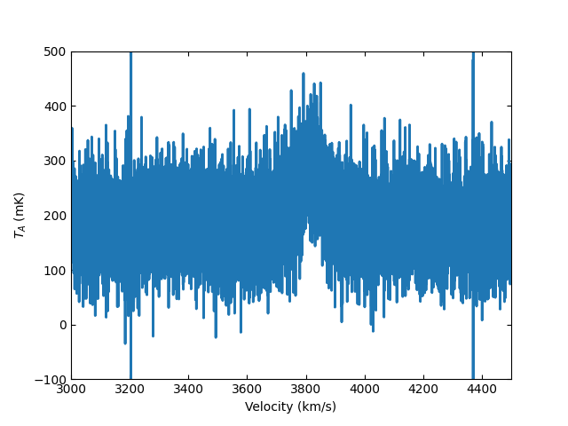
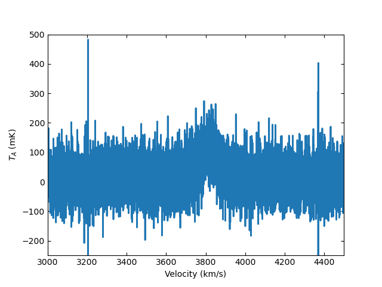

**********************
Position-Switched Data
**********************

Calibrating Position-Switched Data
==================================

Single beam position-switched (PS) data is retrieved using :meth:`~dysh.fits.gbtfitsload.GBTFITSLoad.getps` which returns a :class:`~dysh.spectra.scan.GBTPSScan` position-switched scan object that is used to calibrate and average the data.  First, import the relevant modules::

    >>> from dysh.fits.gbtfitsload import GBTFITSLoad
    >>> import astropy.units as u

..  (TODO need to replace fixed path with get_example_data() and explanation thereof)::

Then load your SDFITS file containing PS data. In this example, we use a 
`GBT SDFITS file downloadable from GBO <http://www.gb.nrao.edu/dysh/example_data/onoff-L/data/TGBT21A_501_11.raw.vegas.fits>`_::

    >>> f = 'TGBT21A_501_11.raw.vegas.fits'
    >>> sdfits = GBTFITSLoad(f)

The returned `sdfits` can be probed for information::

    >>> sdfits.info()
        Filename: /data/gbt/examples/onoff-L/data/TGBT21A_501_11.raw.vegas.fits
        No.    Name      Ver    Type      Cards   Dimensions   Format
          0  PRIMARY       1 PrimaryHDU      12   ()      
          1  SINGLE DISH    1 BinTableHDU    245   6040R x 74C   ['32A', '1D', '22A', '1D', '1D', '1D', '32768E', '16A', '6A', '8A', '1D', '1D', '1D', '4A', '1D', '4A', '1D', '1I', '32A', '32A', '1J', '32A', '16A', '1E', '8A', '1D', '1D', '1D', '1D', '1D', '1D', '1D', '1D', '1D', '1D', '1D', '1D', '8A', '1D', '1D', '12A', '1I', '1I', '1D', '1D', '1I', '1A', '1I', '1I', '16A', '16A', '1J', '1J', '22A', '1D', '1D', '1I', '1A', '1D', '1E', '1D', '1D', '1D', '1D', '1D', '1A', '1A', '8A', '1E', '1E', '16A', '1I', '1I', '1I']   

You can also print a concise (or verbose if you choose `verbose=True`) summary :meth:`~dysh.fits.gbtfitsload.GBTFITSLoad.summary` of the data::

    >>> sdfits.summary()
        SCAN   OBJECT VELOCITY   PROC PROCSEQN  RESTFREQ   DOPFREQ # IF # POL # INT # FEED     AZIMUTH   ELEVATIO
    0  152.0  NGC2415   3784.0  OnOff      1.0  1.617185  1.420406    5     2   151      1  286.218008   41.62843
    1  153.0  NGC2415   3784.0  OnOff      2.0  1.617185  1.420406    5     2   151      1  286.886521  41.118134

Retrieve a scan and its partner ON or OFF, selecting and IF number and polarization, then calibrate it::

    >>> psscan = sdfits.getps(152, ifnum=0, plnum=0)
    >>> psscan.calibrate() # this will be eventually be subsumed into `calibrate=True` in `getps`
        PSSCAN nrows = 302
    
The system temperature array (numpy.ndarray) is stored in `tsys`::

    >>> print(f"T_sys = {pscan.tsys.mean():.2f}:")
        T_sys = 17.17

Then time average the data, using system temperature weighting (other option is 'equal' weighting; 'tsys' is the default if no `weights` parameter is given. Future upgrade will allow the user to provide a numeric weights array). The returned object is :class:`~dysh.spectra.spectrum.Spectrum`, which has a default `matplotlib`-based plotter attached::

    >>> ta = psscan.timeaverage(weights='tsys')
    >>> ta.plot()

.. image:: ../_static/examples/ps_152.png

The :meth:`~dysh.spectra.spectrum.Spectrum.plot` command allows changing of axis units and also recognizes a number matplolib-like keywords::

    >>> ta.plot(xaxis_unit="km/s",yaxis_unit="mK",ymin=-100,ymax=500,xmin=3000,xmax=4500)

Removing a baseline
===================

Baselines can be removed from :class:`~dysh.spectra.spectrum.Spectrum` with the :meth:`~dysh.spectra.spectrum.Spectrum.baseline` function.   Users provide baseline degree and optionally exclude region in any conformable x-axis unit (e.g., frequency, velocity, channel).  The default model is polynomial (:class:`~astropy.modeling.polynomial.Polynomial1D`) but a Chebyshev series (:class:`~astropy.modeling.polynomial.Chebyshev1D`)
is also .  The baseline is removed if `remove=True`. 

    >>> kms = u.km/u.s
    >>> ta.baseline(order=2,exclude=[3600,4100]*kms, remove=True)
    EXCLUDING [Spectral Region, 1 sub-regions:
      (1401242184.363393 Hz, 1403551474.1090915 Hz) 
    ]
    >>> ta.plot(ymin=-200)
    >>> print(ta.baseline_model)Model: Polynomial1D
    Inputs: ('x',)
    Outputs: ('y',)
    Model set size: 1
    Degree: 2
    Parameters:
                 c0                   c1                    c2          
                 K                  K / Hz               K / Hz2        
        ------------------- --------------------- ----------------------
        0.16984671256725348 6.155580136474429e-29 2.2305011385559243e-56

