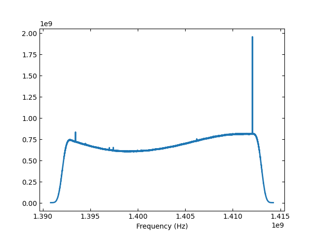

****************
Total Power Data
****************

Retrieving and Viewing a Total Power Scan
=========================================

Single beam total power (TP) data is retrieved using :meth:`~dysh.fits.gbtfitsload.GBTFITSLoad.gettp` which returns a :class:`~dysh.spectra.scan.GBTTPScan` total power scan object that is used to calibrate and average the data.  First, import the relevant module::

    >>> from dysh.fits.gbtfitsload import GBTFITSLoad
    >>> import numpy as np

..  (TODO need to replace fixed path with get_example_data() and explanation thereof)::

Then load your SDFITS file containing TP data. In this example, we use a 
`GBT SDFITS file downloadable from GBO <http://www.gb.nrao.edu/dysh/example_data/onoff-L/data/TGBT21A_501_11.raw.vegas.fits>`_::

    >>> f = 'TGBT21A_501_11.raw.vegas.fits'
    >>> sdfits = GBTFITSLoad(f)

The returned `sdfits` can be probed for information::

    >>> sdfits.info()
        Filename: /data/gbt/examples/onoff-L/data/TGBT21A_501_11.raw.vegas.fits
        No.    Name      Ver    Type      Cards   Dimensions   Format
          0  PRIMARY       1 PrimaryHDU      12   ()      
          1  SINGLE DISH    1 BinTableHDU    245   6040R x 74C   ['32A', '1D', '22A', '1D', '1D', '1D', '32768E', '16A', '6A', '8A', '1D', '1D', '1D', '4A', '1D', '4A', '1D', '1I', '32A', '32A', '1J', '32A', '16A', '1E', '8A', '1D', '1D', '1D', '1D', '1D', '1D', '1D', '1D', '1D', '1D', '1D', '1D', '8A', '1D', '1D', '12A', '1I', '1I', '1D', '1D', '1I', '1A', '1I', '1I', '16A', '16A', '1J', '1J', '22A', '1D', '1D', '1I', '1A', '1D', '1E', '1D', '1D', '1D', '1D', '1D', '1A', '1A', '8A', '1E', '1E', '16A', '1I', '1I', '1I']   

You can also print a concise (or verbose if you choose `verbose=True`) summary :meth:`~dysh.fits.gbtfitsload.GBTFITSLoad.summary` of the data::

    >>> sdfits.summary()
        SCAN   OBJECT VELOCITY   PROC PROCSEQN  RESTFREQ   DOPFREQ # IF # POL # INT # FEED     AZIMUTH   ELEVATIO
    0  152.0  NGC2415   3784.0  OnOff      1.0  1.617185  1.420406    5     2   151      1  286.218008   41.62843
    1  153.0  NGC2415   3784.0  OnOff      2.0  1.617185  1.420406    5     2   151      1  286.886521  41.118134

Retrieve a scan, selecting and IF number and polarization::

    >>> tpscan = sdfits.gettp(152, ifnum=0, plnum=0)
        TPSCAN nrows = 302

The `~dysh.spectra.scan.GBTTPScan` contains the individual integrations.  The system temperatures per integration are calculated from the CALON and CALOFF data::

    >>> print('%s' % (np.array2string(tps.tsys,precision=2)))
        [16.89 16.89 16.94 16.77 16.96 16.94 16.87 16.86 16.92 16.86 16.85 16.97
         16.79 16.86 16.96 17.02 16.94 16.89 16.87 16.92 16.88 16.86 16.92 17.02
         16.77 16.8  17.   16.91 16.91 16.86 16.98 16.81 16.88 17.03 16.96 16.95
         16.8  16.86 16.91 17.02 16.77 17.03 17.03 16.88 16.78 16.88 16.83 16.84
         16.88 17.03 17.01 16.98 16.99 16.92 16.88 16.74 16.87 16.92 16.81 16.88
         16.99 16.97 16.92 17.03 16.94 16.84 16.86 17.05 16.87 16.97 16.82 16.83
         16.98 17.06 17.11 16.98 16.86 17.02 16.88 16.94 16.93 16.98 16.81 16.83
         16.98 17.   16.87 16.91 16.91 16.93 17.   16.91 17.08 16.85 16.9  16.85
         16.89 16.95 17.03 16.98 16.9  16.98 16.98 16.93 16.83 17.03 16.97 16.92
         16.87 16.99 16.87 16.84 16.97 16.84 16.89 16.89 16.98 16.89 16.81 16.76
         16.94 16.95 16.89 16.87 16.94 16.91 17.1  16.91 16.84 16.84 16.88 16.95
         17.04 16.88 16.9  17.03 16.9  16.84 16.99 16.95 16.94 17.02 17.01 16.91
         16.95 16.91 16.92 17.08 16.67 17.06 17.14]

You can time-average the data, in this example with equal weighting per integration, and plot it::

    >>> tps.timeaverage(weights=None).plot()

