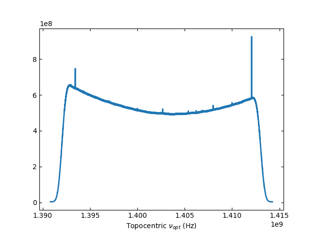

****************
Total Power Data
****************

Retrieving and Viewing a Total Power Scan
=========================================

Single beam total power (TP) data is retrieved using :meth:`~dysh.fits.gbtfitsload.GBTFITSLoad.gettp` which returns a :class:`~dysh.spectra.scan.GBTTPScan` total power scan object that is used to calibrate and average the data.  First, import the relevant module

.. code:: python

    >>> from dysh.fits.gbtfitsload import GBTFITSLoad
    >>> import wget
    >>> import numpy as np

..  (TODO need to replace fixed path with get_example_data() and explanation thereof)::

Download the data from GBO

.. code:: python

    >>> filename = wget.download("http://www.gb.nrao.edu/dysh/example_data/onoff-L/data/TGBT21A_501_11.raw.vegas.fits")
    >>> print(filename)
        TGBT21A_501_11.raw.vegas.fits

.. note::
    The data used for this tutorial is ~800 MB. Make sure you have enough disk space and bandwidth to download it.

Then load your SDFITS file containing TP data. In this example, we use a
`GBT SDFITS file downloadable from GBO <http://www.gb.nrao.edu/dysh/example_data/onoff-L/data/TGBT21A_501_11.raw.vegas.fits>`_

.. code:: python

    >>> sdfits = GBTFITSLoad(filename)

The returned `sdfits` can be probed for information

.. code:: python

    >>> sdfits.info()
    Filename: TGBT21A_501_11.raw.vegas.fits
    No.    Name      Ver    Type      Cards   Dimensions   Format
      0  PRIMARY       1 PrimaryHDU      12   ()
      1  SINGLE DISH    1 BinTableHDU    245   6040R x 74C   ['32A', '1D', '22A', '1D', '1D', '1D', '32768E', '16A', '6A', '8A', '1D', '1D', '1D', '4A', '1D', '4A', '1D', '1I', '32A', '32A', '1J', '32A', '16A', '1E', '8A', '1D', '1D', '1D', '1D', '1D', '1D', '1D', '1D', '1D', '1D', '1D', '1D', '8A', '1D', '1D', '12A', '1I', '1I', '1D', '1D', '1I', '1A', '1I', '1I', '16A', '16A', '1J', '1J', '22A', '1D', '1D', '1I', '1A', '1D', '1E', '1D', '1D', '1D', '1D', '1D', '1A', '1A', '8A', '1E', '1E', '16A', '1I', '1I', '1I']

You can also print a concise (or verbose if you choose `verbose=True`) summary :meth:`~dysh.fits.gbtfitsload.GBTFITSLoad.summary` of the data

.. code:: python

    >>> sdfits.summary(show_index=True)
        SCAN   OBJECT VELOCITY   PROC PROCSEQN  RESTFREQ   DOPFREQ # IF # POL # INT # FEED     AZIMUTH   ELEVATIO
    0  152.0  NGC2415   3784.0  OnOff      1.0  1.617185  1.420406    5     2   151      1  286.218008   41.62843
    1  153.0  NGC2415   3784.0  OnOff      2.0  1.617185  1.420406    5     2   151      1  286.886521  41.118134

Retrieve a scan, selecting and IF number and polarization

.. note::
    For each scan in the summary `dysh` shows the mean of the VELOCITY, RESTFREQ, DOPFREQ, AZIMUTH and ELEVATIO columns, while `GBTIDL` reports the value of the first integration for a scan. If you use `verbose=True` in `dysh` you get all the integrations.

.. code:: python

    >>> tpscan = sdfits.gettp(scan=152, ifnum=0, plnum=0)

Inside the returns `~dysh.spectra.scan.ScanBlock` is one `~dysh.spectra.scan.TPScan` that contains the individual integrations.  The system temperatures per integration are calculated from the CALON and CALOFF data

.. code:: python

    >>> print('%s' % (np.array2string(tpscan[0].tsys, precision=2)))
    [17.46 17.47 17.51 17.48 17.27 17.24 17.43 17.51 17.36 17.41 17.27 17.36
     17.28 17.31 17.15 17.   17.54 17.21 17.4  17.38 17.49 17.43 17.15 17.2
     17.45 17.15 17.31 17.31 17.1  17.48 17.29 17.24 17.52 17.31 17.19 17.1
     17.35 17.14 17.38 17.48 17.22 17.5  17.33 17.27 17.41 17.2  17.48 17.21
     17.37 17.47 17.25 17.18 17.25 17.17 17.14 17.36 17.25 17.28 17.25 17.19
     17.36 17.14 17.48 17.17 17.36 17.43 17.51 17.38 17.29 17.19 17.4  17.63
     17.36 17.27 17.19 17.45 17.39 17.48 17.24 17.31 17.13 17.22 17.24 17.42
     17.1  17.5  17.38 17.24 17.42 17.32 17.27 17.35 17.29 17.49 17.4  17.18
     17.18 17.28 17.26 17.48 17.38 17.35 17.28 17.25 17.28 17.39 17.25 17.24
     17.08 17.28 17.28 17.36 17.53 17.38 17.34 17.48 17.43 17.49 17.29 17.44
     17.32 17.5  17.11 17.38 17.24 17.2  17.37 17.21 17.19 17.32 17.01 17.48
     17.34 17.35 17.5  17.01 17.44 17.45 17.4  17.38 17.18 17.44 17.22 17.25
     17.28 17.19 17.38 17.34 17.3  17.26 17.37]

You can time-average the data, in this example with equal weighting per integration, and plot it

.. code:: python

    >>> tpscan.timeaverage(weights=None).plot()

