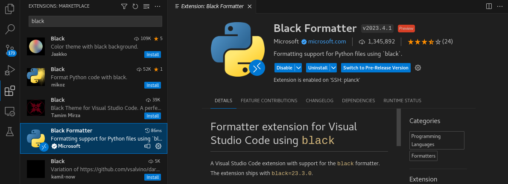
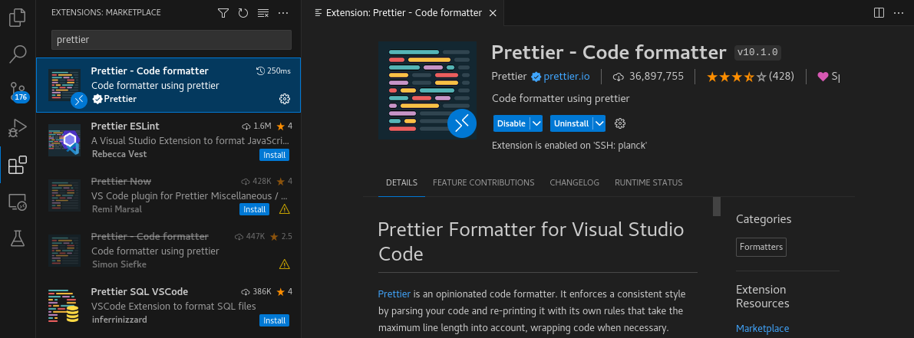

****************
Black Formatting
****************

VSCode
=================

If you are developing in VSCode, you can install `black` directly into the IDE and have it run every time you save a Python file. 

1. Download the Black Formatter Extension by Microsoft

2. (Optional) Download the Prettier Formatter

`Prettier` will format files in languages besides Python. It is not required for `dysh`, but it does make it look nicer. 

3. Check the VSCode Project Settings

The JSON file ``dysh/.vscode/settings.json`` contains VSCode settings for this project. The contents are as follows:

.. code-block:: json

    {
        "editor.defaultFormatter": "esbenp.prettier-vscode",
        "editor.formatOnSave": true,
        "[python]": {
            "editor.defaultFormatter": "ms-python.black-formatter",
            "editor.formatOnSave": true
        },
        "python.formatting.blackArgs": ["--line-length 120"]
    }

If you did not install `Prettier`, delete the first two entries. If you do not want certain languages to auto-format on every save, then set their corresponding ``"editor.defaultFormatter"`` to ``false``.