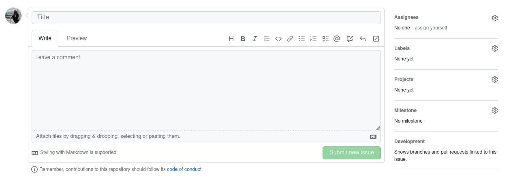

*******************
GitHub Integrations
*******************

Actions
=======

Tests should be named `test_*.py` and located within a `tests` directory of their parent module. To define a workflow that runs the tests, create a new `.yml` file in `dysh/.github/workflows/`.

.. _githubissues:

Issues
======

We use GitHub Issues to keep track of things that need doing. If you can't get to something right away, might as well make an issue so we remember to do it. Beta testers will also use issues to report on their findings.

To submit an issue, use the following steps:

1. Go to https://github.com/GreenBankObservatory/dysh/issues
2. Select "New Issue"

Pre-Commit Hooks
================

Take a look at `dysh/.pre-commit-config.yaml`.

Projects
========

There are 2 GitHub Projects defined for this repository.
