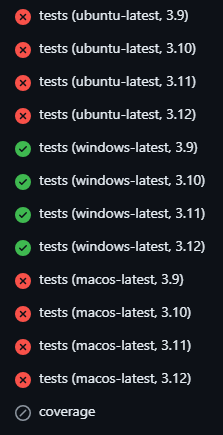

*********************
Managing Requirements
*********************

Say you have a new package called `example-package` to add as a dependency. Here are the steps to do so properly.

Step 1: Update `pyproject.toml`
===============================

You first need to add the package to `pyproject.toml`. Locate the section of the file which lists the dependencies. It should look like this:

.. code-block:: Python

    dependencies = [
        "astropy<6.1.0",
        "ipython",
        "jplephem",
        "matplotlib",
        "numpy",
        "pandas",
        "scipy",
        "specutils",
        "wget",
        ]

    [project.optional-dependencies]
    dev = [
        "coverage[toml]",
        "ipdb",
        "numpydoc",
        "pytest",
        "pytest-cov",
        "sphinx",
        "sphinx-autobuild",
        "sphinx-inline-tabs",
        "sphinx-rtd-theme",
        "sphinxcontrib-mermaid",
        ]
    nb = [
        "jupyter",
        "jupyterlab",
        ]
    gui = [
        "pyqt5",
        "pyqt5-qt5==5.15.14 ; platform_system != \"Windows\"",
        "pyqt5-qt5==5.15.2 ; platform_system == \"Windows\"",
        "pyqtgraph",
        "qt_material",
        "screeninfo",
    ]
    all = ["dysh[dev,nb,gui]"]

* If the package is needed for `dysh` functionality, add it to the `dependencies = [...]` list.

* If the package is only needed for development, add it to the `dev = [...]` list.

* If the package is needed for notebooks, add it to the `nb = [...]` list.

* If the package is needed for interactive plotting, add it to the `gui = [...]` list.

Step 2: Compile `requirements.txt`
==================================

Using the lowest supported version of Python (currently 3.10), do the following:

.. code-block:: bash

    $ cd /path/to/dysh
    $ source /path/to/dysh-venv-py3.10/bin/activate
   (dysh-venv-py3.10) $ pip install pip-tools
   (dysh-venv-py3.10) $ pip-compile -o requirements.txt pyproject.toml

Step 3: Validate new requirements
=================================

Push these two changed files to GitHub. Then, verify that all GitHub Actions tests pass to ensure that these requirements work for all supported versions of Python and all supported operating systems.

Things that can go wrong
========================

Alas, problems can arise. Here are a few that have been encountered and solved so far.

Compiling requirements on Windows
---------------------------------

Sometimes, compiling `requirements.txt` on a Windows machine can result in requirements which fail on the other operating systems. This will result in your GitHub Actions only succeeding on Windows machines, like so:

**Solution:** Compile `requirements.txt` on a non-Windows machine, like the Linux ones at GBO.

Platform-dependent versions
---------------------------

Some packages may require different versions for different operating systems. If you cannot resolve a dependency issue another way, there is a solution.

**Solution:** Pin the versions in the `pyproject.toml` file, then re-compile the `requirements.txt`. Here is an example of a pinned version of `pyqt5-qt5` within the `gui` dependencies:

.. code-block:: Python

    gui = [
        "pyqt5",
        "pyqt5-qt5==5.15.14 ; platform_system != \"Windows\"",
        "pyqt5-qt5==5.15.2 ; platform_system == \"Windows\"",
        "pyqtgraph",
        "qt_material",
        "screeninfo",
        ]
