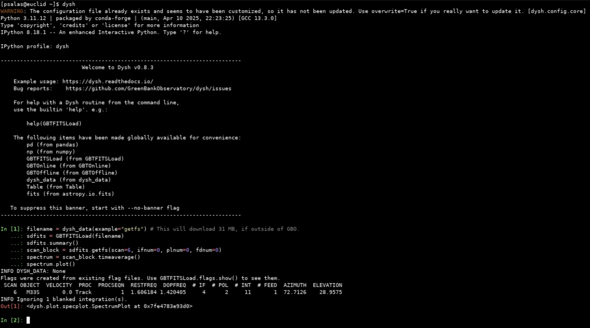
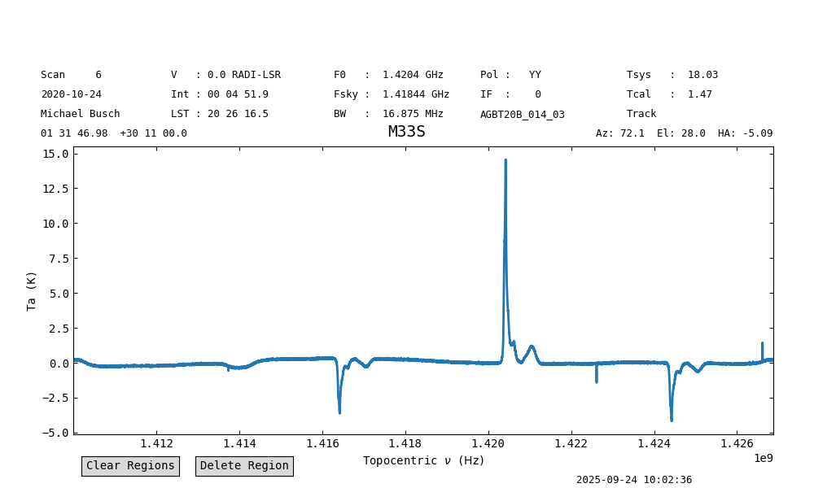

.. |minver| replace:: ``0.8.3``
.. |minpatch| replace:: ``0.8.4``
.. |pymin| replace:: 3.10
.. |pymax| replace:: 3.12
.. |pyupp| replace:: 3.13

***************
Getting Started
***************

Using ``dysh`` at GBO
=====================

If you have access to a `GBO data reduction host <https://greenbankobservatory.org/portal/gbt/processing/#data-reduction-machines>`_ (e.g., fourier, thales, etc.), then you should be able to launch the latest version of ``dysh`` from a terminal by typing

.. code:: bash

    dysh

The first time you run this, it may take a minute.
To verify you are getting the latest version, check the output of these commands:

.. code:: bash

    which dysh

Should print: ``/opt/local/bin/dysh``. And

.. code:: bash

    dysh --version

Should print |minver| or higher (e.g., |minpatch|).

If you want to install your own version of ``dysh`` instead, read the following section.

Installing ``dysh``
===================

``dysh`` requires a Python version between |pymin| and |pymax| (``dysh`` has not been tested in Python |pyupp| or above) and recent versions of
`astropy <https://astropy.org>`_,
`numpy <https://numpy.org>`_,
`scipy <https://scipy.org>`_,
`pandas <https://pandas.pydata.org>`_,
`specutils <https://specutils.readthedocs.io/en/stable/>`_,  and
`matplotlib <https://matplotlib.org>`_.

We strongly recommend the use of a virtual environment for installing ``dysh``.

Linux and MacOS
---------------

.. tab:: Outside of GBO

    The details of how to install ``dysh`` on your own depend on what package manager you use (e.g., ``uv``, ``conda``, ``pip``).
    We strongly recommend that you install ``dysh`` in a separate Python environment, so you do not change your system Python (if you use your own anaconda3, you can of course do anything you like, though we still recommend a virtual environment).
    It is important to note that the latest version of ``dysh`` will only work on Python versions between |pymin| and |pymax| (``dysh`` has not been tested on Python |pyupp| or above).
    Here we provide a few examples, which require the ability to install Python packages in your system.

    .. tab:: Using ``conda``

        If you use ``conda``, then you can use the following commands

        #. Create a dedicated virtual environment for ``dysh``, with Python 3.12 (you could use a Python version between |pymin| and |pymax|)

           .. code-block:: bash

                conda create -n dysh-venv python==3.12

        #. Activate the newly created virtual environment

           .. code-block:: bash

                conda activate dysh-venv

        #. Install ``dysh`` into the environment

           .. code-block:: bash

                pip install "dysh[nb] @ git+https://github.com/GreenBankObservatory/dysh"

        #. ``dysh`` should now be available through the ``dysh`` command. You can make sure you installed the latest version by running

           .. code-block:: bash

                dysh --version

           It should print |minver| or higher (e.g., |minpatch|).

    .. tab:: Using ``venv``

        If you already have Python |pymin|, up to |pymax|, installed you can create a new virtual environment using ``venv``.

        #. Create a dedicated virtual environment for ``dysh``, with Python |pymax|:

           .. code-block:: bash

                python3.12 -m venv dysh-venv

           Having ``python3.12`` available as above may change depending on your own system.
           Make sure you are using a Python version between |pymin| and |pymax| with ``python --version``.

        #. Activate the newly created virtual environment

           .. code-block:: bash

                pip install "dysh[nb] @ git+https://github.com/GreenBankObservatory/dysh"

        #. ``dysh`` should now be available through the ``dysh`` command.
           You can check what version you installed by running:

           .. code-block:: bash

                dysh --version

           It should print |minver| or higher (e.g., |minpatch|).

    .. tab:: Using ``uv``

        If you use `uv <https://docs.astral.sh/uv/>`_ then the following command will install ``dysh``:

        .. code-block:: bash

            uv tool install "dysh[nb] @ git+https://github.com/GreenBankObservatory/dysh"

        ``dysh`` should now be available through the ``dysh`` command. You can check what version you installed by running:

        .. code-block:: bash

            dysh --version

        It should print |minver| or higher (e.g., |minpatch|).

        .. warning::

            Installing ``dysh`` using this method will install it as a tool, not a package, so it won't be possible to ``import dysh`` from a Python session.

.. tab:: At GBO

    At GBO, on a linux machine from the terminal (assumes you’re using bash).

    #. First, create a new Python virtual environment. For this example we will use Python 3.11 (you can change the Python version, but the latest ``dysh`` will only work on Python between |pymin| and |pymax|):

       .. code-block:: bash

            /users/gbosdd/python/bin/python3.11 -m venv /home/scratch/$USER/dysh-env

    #. Activate the virtual environment:

       .. code-block:: bash

            source /home/scratch/$USER/dysh-env/bin/activate

    #. Install ``dysh``, and the additional dependencies to run Jupyter lab:

       .. code-block:: bash

            pip install "dysh[nb] @ git+https://github.com/GreenBankObservatory/dysh"

       If you do not want the additional dependencies, remove the [nb] part.

    #. Check what ``dysh`` version was installed:

       .. code-block:: bash

            dysh --version

       It should show |minver| or higher (e.g., |minpatch|), if using Python between |pymin| and |pymax| (to check the Python version use ``python --version``).

    #. Launch the command line interface

       .. code-block:: bash

            dysh

       or the Jupyter lab interface (only available if you used the [nb] option, or if you installed Jupyter lab)

       .. code-block:: bash

            dysh-lab

Windows
-------

We provide instructions on how to install the latest version of ``dysh`` on Windows using `anaconda <https://www.anaconda.com/>`_ and `git <https://git-scm.com/>`_.
Anaconda provides a way of installing ``Python`` and managing virtual environments, and ``git`` is used to download, and install, the source code for the latest version of ``dysh``.
If you want to install the latest stable version of ``dysh``, then it is not necessary to use ``git``.

#. The first step is to download and install Anaconda and ``git``.
   Anaconda comes in two flavors, as Anaconda distribution or as Miniconda.
   The Anaconda documentation provides details on the differences between both (`link <https://www.anaconda.com/docs/getting-started/getting-started#should-i-use-anaconda-distribution-or-miniconda%3F>`_), but the short story is that Anaconda has a graphical user interface (GUI), it comes with more packages pre-installed, but it uses more disk space.
   Miniconda does not have a GUI and it comes with less packages pre-installed. Both provide access to ``conda``, which is the tool we will use to create a new virtual environment.
   You can find the downloads for Anaconda distribution and Miniconda `here <https://www.anaconda.com/download/success>`_.
   ``git`` can be downloaded `here <https://git-scm.com/downloads>`_.
   ``git`` is highly customizable, so it will ask a bunch of questions during the installation.
   For our purposes, the defaults should work.
   The most important part is to have ``git`` available through the command line (e.g., PowerShell).

#. After installing Anaconda or Miniconda, there should be an Anaconda menu in the start menu.

   .. image:: img/windows-menu.png
        :width: 400
        :alt: Windows start menu after installing Miniconda

   In the dropdown select either the Anaconda Prompt or the Anaconda PowerShell Prompt.
   This will launch a new terminal with the base virtual environment activated.

   .. image:: img/windows-terminal.png
        :width: 800
        :alt: Fresh Windows terminal

#. In the terminal enter the following command

   .. code-block:: powershell

        conda create -n dysh-venv python==3.10

   This will create a new virtual environment with ``Python3.10``.
   You can use other versions of ``Python``, but not lower than |pymin| nor above |pymax|.
   ``dysh`` has not been tested with ``Python`` |pyupp| and above.
   You can check the ``Python`` version using the command ``python --version`` in the terminal.

#. After creating the environment, activate it. Enter the following command

   .. code-block:: powershell

        conda activate dysh-venv

   If everything went well you should see that the command line prompt now says ``(dysh-env)`` at the start of the current line.

#. Install ``dysh``, with all the dependencies required to run a Jupyter lab server (not required). Enter the following command

   .. code-block:: powershell

        pip install "dysh[nb] @ git+https://github.com/GreenBankObservatory/dysh"

   This will download and install ``dysh`` with all its dependencies to the ``dysh-env`` virtual environment.
   Depending on your internet connection, this may take a while.
   If you do not want the extra dependencies, remove the ``[nb]`` part in the command.

#. If everything went well, the following commnad should print the ``dysh`` version

   .. code-block:: powershell

        dysh --version

   This should print |minver| or above (e.g., |minpatch|).

#. Launch the command line interface

   .. code-block:: powershell

        dysh

   or the Jupyter lab interface (only available if you used the [nb] option, or if you installed Jupyter lab)

   .. code-block:: powershell

        dysh-lab

   The Jupyter lab interface will launch in your default browser, unless you have changed the Jupyter settings.
   You can avoid launching a browser with the ``--no-browser`` option, so the command would be

   .. code-block:: powershell

        dysh-lab --no-browser

   Then you can copy and paste the url in your preferred browser.

Quick Test
==========

After installing ``dysh`` you can run the following commands to make sure everyhting is working fine.
This quick example will download a 31 MB file to the current directory.

#. Launch ``dysh``

   .. code-block:: bash

        dysh

#. Copy and paste the following

   .. code-block:: python

        from dysh.util.files import dysh_data
        filename = dysh_data(example="getfs") # This will download 31 MB, if outside of GBO.
        sdfits = GBTFITSLoad(filename)
        sdfits.summary()
        scan_block = sdfits.getfs(scan=6, ifnum=0, plnum=0, fdnum=0)
        spectrum = scan_block.timeaverage()
        spectrum.plot()

This should look like

And the plot command should produce the following figure

