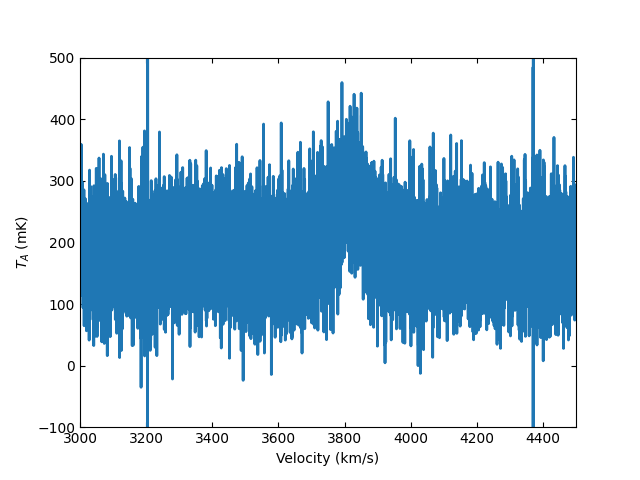

***************************************
Working with GBT Position-Switched Data
***************************************

Learning Goals
==============

* Installing `dysh` using `pip`.
* Showing a summary of your data.
* Calibrating a position switched pais of scans using `getps`.
* Plotting the time averaged calibrated data.

Summary
=======

In this tutorial you will learn how to use `dysh` to work with position switched data observed with the Green Bank Telescope (GBT).

The tutorial will walk you through how to install `dysh`, download a raw GBT SDFITS file using `wget`, and then use `dysh` to get a summary of the contents of an SDFITS file, calibrate the raw data and display it.

Tutorial
========

Installing `dysh`
-----------------

You can install `dysh` using `pip`. From a terminal type

.. code:: bash

    pip install dysh

After installing `dysh` you can start it by typing `dysh` in a shell. Alternatively, you can import it as any other `Python` module.

.. code:: bash

    dysh

Downloading the raw data
------------------------

In a `Python` instance, type

.. code:: python

    >>> import wget
    >>> url = "http://www.gb.nrao.edu/dysh/example_data/onoff-L/data/TGBT21A_501_11.raw.vegas.fits"
    >>> filename = wget.download(url)
    >>> print(filename)
    TGBT21A_501_11.raw.vegas.fits

Keep the `Python` instance open, we will start working with `dysh` now.

.. note::
    The data used for this tutorial is ~800 MB. Make sure you have enough disk space and bandwidth to download it.

Inspecting the raw data
-----------------------

To import the relevant `dysh` functions type

.. code:: python

    >>> from dysh.fits.gbtfitsload import GBTFITSLoad

Now you will load the raw data and show a summary of its contents

.. code:: python

    >>> sdfits = GBTFITSLoad(filename)
    >>> sdfits.summary(show_index=True)
        SCAN   OBJECT VELOCITY   PROC PROCSEQN  RESTFREQ   DOPFREQ # IF # POL # INT # FEED     AZIMUTH   ELEVATIO
    0    152  NGC2415   3784.0  OnOff        1  1.617185  1.420406    5     2   151      1  286.218008   41.62843
    1    153  NGC2415   3784.0  OnOff        2  1.617185  1.420406    5     2   151      1  286.886521  41.118134

Calibrating a position switched scan
------------------------------------

The following lines will let you calibrate and time average the position switched pair of scans 152 and 153.

.. code:: python

    >>> psscan = sdfits.getps(scan=152, ifnum=0, plnum=0)
    >>> ta = psscan.timeaverage(weights='tsys')

Plotting the calibrated data
----------------------------

.. code:: python

    >>> ta.plot(xaxis_unit="km/s", yaxis_unit="mK", ymin=-100, ymax=500, xmin=3000, xmax=4500)

