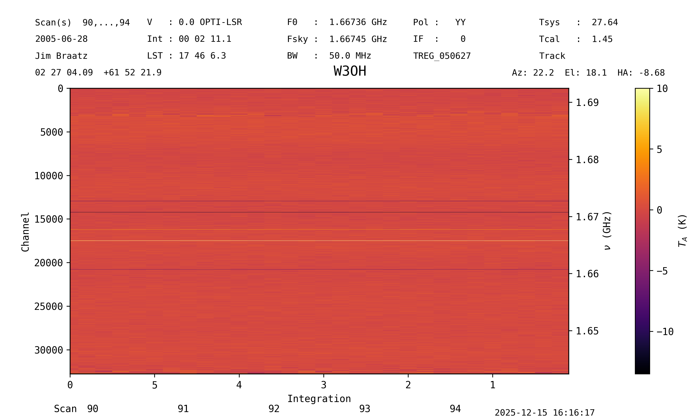
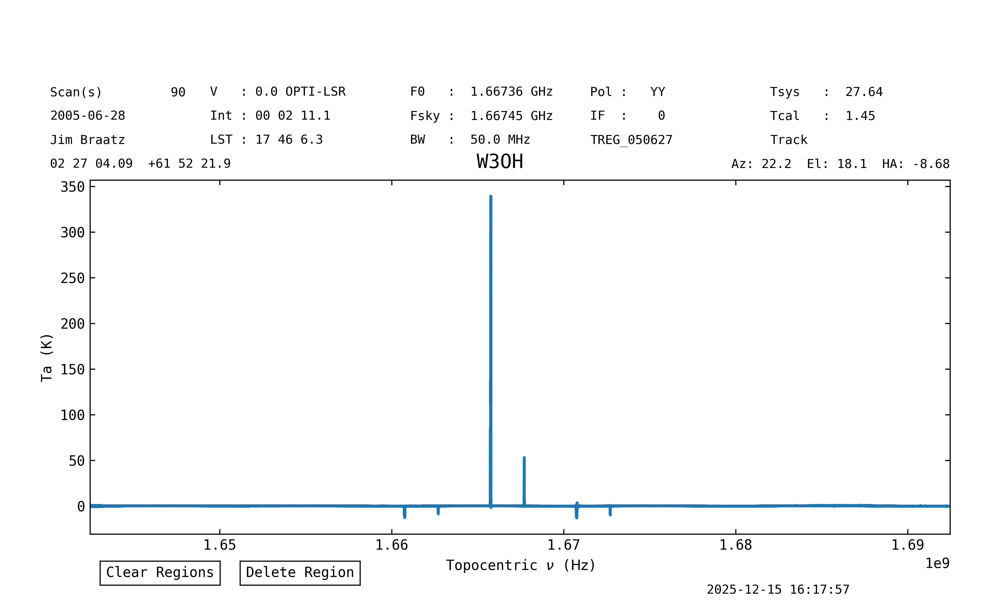
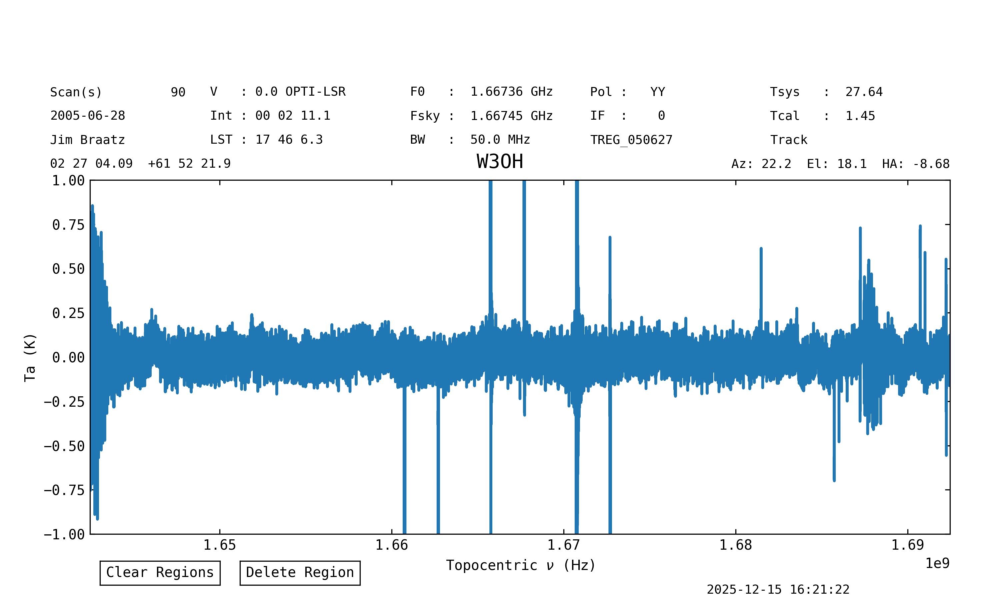
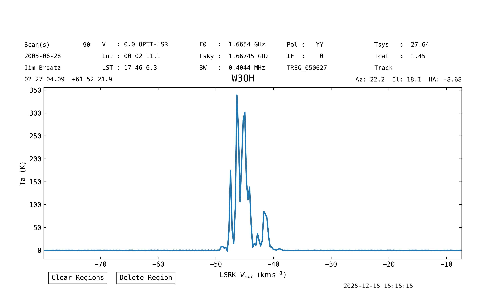

.. _quickstartguide:

****************
Quickstart Guide
****************

dysh is a Python spectral line data reduction and analysis program for single dish data with specific emphasis on data from the Green Bank Telescope.
It is currently under development in collaboration between the `Green Bank Observatory <https://greenbankobservatory.org>`_ and the Laboratory for Millimeter-Wave Astronomy (LMA) at the `University of Maryland (UMD) <https://www.astro.umd.edu>`_.
It is intended to replace `GBTIDL <https://gbtidl.nrao.edu/>`_, GBO's current spectral line data reduction package.

Below is a "quickstart" guide with the essentials. A deeper dive into dysh's capablities can be found in the `Users Guide <usersguide>`_.

Installation
============

Directly from github:

.. code:: bash

    pip install "dysh[nb] @ git+https://github.com/GreenBankObservatory/dysh"

Latest stable release on PyPI:

.. code:: bash

    pip install dysh[nb]

Read on for a brief overview.

.. tip::

    You can find detailed installation instructions in :ref:`installing-dysh`.

Launching dysh
==============

After being installed, the ``dysh`` command will be available through the command line.
This will launch an `iPython <https://ipython.readthedocs.io/en/stable/>`_ session with some modules and classes pre-loaded (e.g., `~dysh.fits.gbtfitsload.GBTFITSLoad`), and with logging.
We refer to this interface as the dysh shell.

Loading Data
============

dysh can read and write :ref:`SDFITS files <sdfits-explanation>`.
Once inside the dysh shell loading an :ref:`SDFITS file <sdfits-explanation>` can be done using `~dysh.fits.gbtfitsload.GBTFITSLoad`.
The following lines of code will download an SDFITS, and then open it using `~dysh.fits.gbtfitsload.GBTFITSLoad`.
Downloading this data set is only required to follow this quick start as is.

.. code:: Python

    from dysh.util.download import from_url
    # The following line will download 31 MB to the current working directory.
    filename = from_url("http://www.gb.nrao.edu/dysh/example_data/frequencyswitch/data/TREG_050627/TREG_050627.raw.acs/TREG_050627.raw.acs.fits")
    sdfits = GBTFITSLoad(filename) # This will load the SDFITS file(s) at `filename`.

In the above code, you can replace ``filename`` with a path to your own data.
Either a single SDFITS file or a directory containing multiple SDFITS files will work.

The contents of the loaded data can be inspected using the `GBTFITSLoad.summary <dysh.fits.gbtfitsload.GBTFITSLoad.summary>` method, as:

.. code:: Python

    sdfits.summary()

.. raw:: html
    :file: files/example_getfs_summary.html

This shows five scans of W3OH.
We know that this data was observed using :term:`frequency switching`.

Calibrating Data
================

Since the data was observed using frequency switching, we use the `GBTFITSLoad.getfs <dysh.fits.gbtfitsload.GBTFITSLoad.getfs>` method to calibrate the data.
This method requires the :term:`fdnum`, :term:`ifnum` and :term:`plnum` parameters, and it will return a :ref:`ScanBlock <scanblocks>` object.

.. code:: Python

    scan_block = sdfits.getfs(fdnum=0, ifnum=0, plnum=0)

That's it, now ``scan_block`` contains all the calibrated data.

.. tip::

    More details about the different calibration routines can be
    found on the `calibration section of the users guide <users_guide/procedures.html>`_.

The calibrated data can be plotted as a waterfall using `ScanBlock.plot <dysh.spectra.scan.ScanBlock.plot>`.
To plot the data as a waterfall saturating the color scale at 10 K use:

.. code:: Python

    scan_block_plot = scan_block.plot(vmax=10)

This method returns a `~dysh.plot.scanplot.ScanPlot` object, which can be used to modify the plot.
See the :ref:`waterfall plot guide <scanblock-plots>` for more details.

More details about the different calibration routines can be found on :ref:`the calibration section of the users guide <usersguide-procedures>`.

Time Averaging Data
===================

Time averaging the calibrated data into a single spectrum can be done using the `ScanBlock.timeaverage <dysh.spectra.scan.ScanBlock.timeaverage>` method, like:

.. code:: Python

    spectrum = scan_block.timeaverage()

This method returns a `~dysh.spectra.spectrum.Spectrum` object.

Plot the spectrum using the `Spectrum.plot <dysh.spectra.spectrum.Spectrum.plot>` method:

.. code:: Python

    spec_plot = spectrum.plot()

This method returns a `~dysh.plot.specplot.SpectrumPlot` object, which can be used to modify the plot.
See the :ref:`spectrum plot guide <spectrum-plots>` for more details.

Baseline Removal
================

To remove a baseline from the data use the `Spectrum.baseline <dysh.spectra.spectrum.Spectrum.baseline>` method.
This can use different polynomials to fit and remove a baseline from the spectrum.
To fit and remove a Chebyshev polynomial of degree 17, ignoring regions with spectral lines, and their ghosts, use:

.. code:: Python

    # Define the channel ranges to be
    # excluded from the baseline fit.
    exclude = [(12720, 13259),
               (14060, 14440),
               (16000, 16420),
               (17375, 17640),
               (19355, 19660),
               (20575, 20955)]
    spectrum.baseline(model="chebyshev", degree=17, remove=True, exclude=exclude)

The spectrum has been baseline removed.
The `spectrum plot guide <iplotter>`_ shows how to interactively include/exclude portions by clicking and dragging on the plot itself (without typing out all the tuples of 5-digit channel ranges)

Plot again, but focus on the line-free regions:

.. code:: Python

    spec_plot = spectrum.plot(ymax=1, ymin=-1)

Polarization Average
====================

Polarization averaging can be done at the spectrum level, that is, after time averaging the data.
In this example we will calibrate the data for the second polarization (``plnum=1``) following the same steps as for the first one, and then average them together.
Calibrate, time average and baseline subtract the second polarization.
We use the same range of channels and baseline model to fit the baseline.

.. code:: Python

    scan_block1 = sdfits.getfs(fdnum=0, ifnum=0, plnum=1)
    spectrum1 = scan_block1.timeaverage()
    spectrum1.baseline(model="chebyshev", degree=17, remove=True, exclude=exclude)

Now we proceed to average the spectra with the two polarizations, ``spectrum`` and ``spectrum1``:

.. code:: Python

    sp_avg =  spectrum.average(spectrum1)

Slicing a Spectrum
==================

The brightest line is the OH maser at 1665.4018 MHz.
To crop the spectrum around this line we use a `slice`.
We will use `astropy.units` (imported automatically as ``u``) to define the frequency range:

.. code:: Python

    oh_bright_spec = spectrum[1665.3*u.GHz:1665.9*u.MHz]

Change the rest frequency to that of the 1665.4018 MHz line:

.. code:: Python

    oh_bright_spec.doppler_rest = 1665.4018 * u.MHz

Plot in velocity units (``xaxis_unit``) using the local standard of rest as velocity frame (``vel_frame``) and the radio Doppler convention (``doppler_convention``):

.. code:: Python

    oh_bright_spec.plot(xaxis_unit="km/s", vel_frame="lsrk", doppler_convention="radio")

Note that the setting the units, velocity frame or Doppler convention during plotting does not modify the spectrum.

Saving a Spectrum
=================

Save the spectrum to a FITS file (notice this is not SDFITS, for SDFITS use ``format=sdfits``):

.. code:: Python

    oh_bright_spec.write("W3OH_1665MHz_pol0.fits", format="fits")

Or to a text file:

.. code:: Python

    oh_bright_spec.write("W3OH_1665MHz_pol0.txt", format="basic")

Reporting Issues
================

If you find a bug or something you think is in error, please report it on
the `GitHub issue tracker <https://github.com/GreenBankObservatory/dysh/issues>`_.
You must have a `GitHub account <https://github.com>`_ to submit an issue.

.. toctree::
   :maxdepth: 1
   :hidden:

   self
   whatsnew/CHANGES
   getting_started/index
   users_guide/index
   reference/index
   for_beta_testers/index
   for_developers/index

Credits
=======
dysh is being developed by a partnership between the Green Bank Observatory and the Laboratory for Millimeter-wave Astronomy at the University of Maryland, College Park.

Dev Team
--------
| Marc Pound (UMD)
| Peter Teuben (UMD)
| Pedro Salas (GBO)
| Evan Smith (GBO)
| Thomas Chamberlin (GBO)

Earlier contributors
--------------------
| Victoria Catlett (former GBO)
