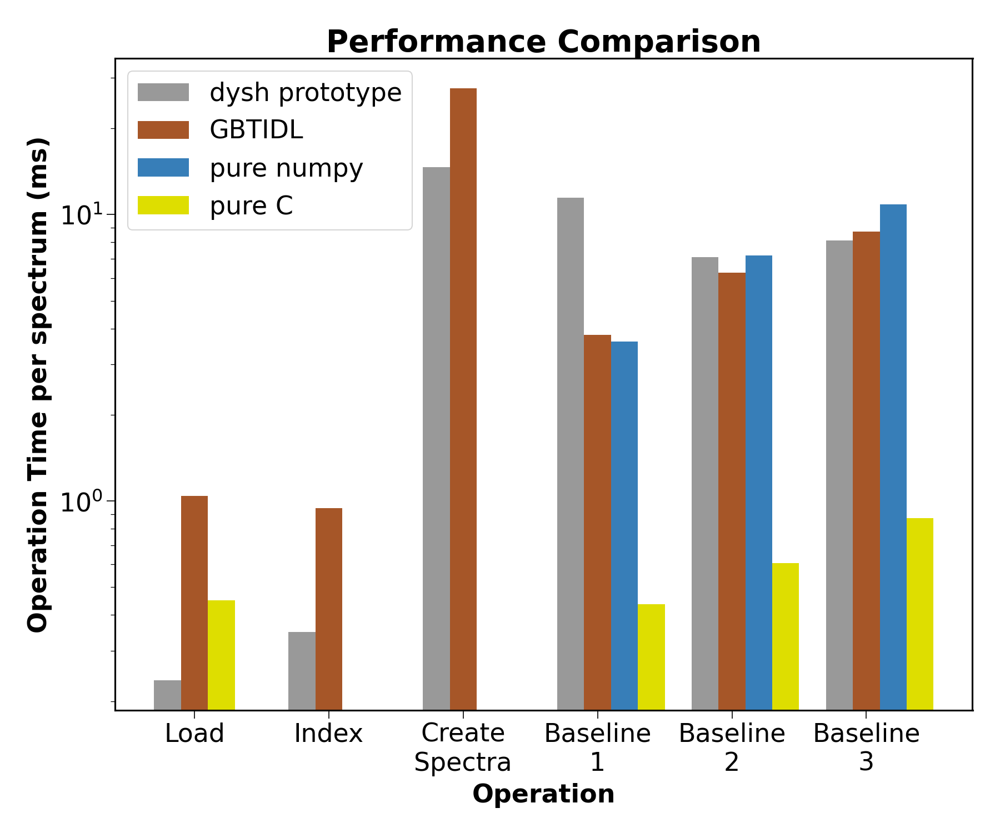

**********************
Performance vs. GBTIDL
**********************

One of the requirements of `dysh` is that be computationally as fast or faster than `GBTIDL`, specifically (from the Requirements document):

**5.3-R1** *The software must be capable of the data reduction processes with the same or better accuracy and speed as GBTIDL.*

Using our prototype design of `SDFITSLoad` and a spectrum class based on `specutils.Spectrum1D`, we profiled the code in 4 operations:

1. Loading an SDFITS file with one or more HDUs
2. Creating an index for each HDU from the FITS bintable columns using pandas
3. Creating a spectrum object for each row in the bintable
4. Removing baselines of order 1, 2 and 3 from each spectrum, excluding the inner 25% of channels from the fit.

The equivalent GBTIDL commands were also profiled, as well as a pure `numpy` and pure C approach for steps 1 and 4.  The latter represents the maximum possible speed at which an operation could run.

We used SDFITS files between 4MB and 23GB in size with number of rows ranging between 352 and 92032 and number of channels ranging between 1024 and 65536.

The result is that `dysh` performs **better** than `GBTIDL` in loading and indexing files and creating spectra, and **comparably well** for baselining (*with no optimization*). The prototype design can easily handle large files and spectra with many channels.

    Performance of `dysh` versus `GBTIDL` in common operations.  `dysh` is significantly faster in loading SDFITS files and creating indices (equivalent of GBTIDL index file) and creating spectra.  It is comparable in removing baselines of arbitrary order.  No attempt was made to optimize the prototype `dysh` code.

