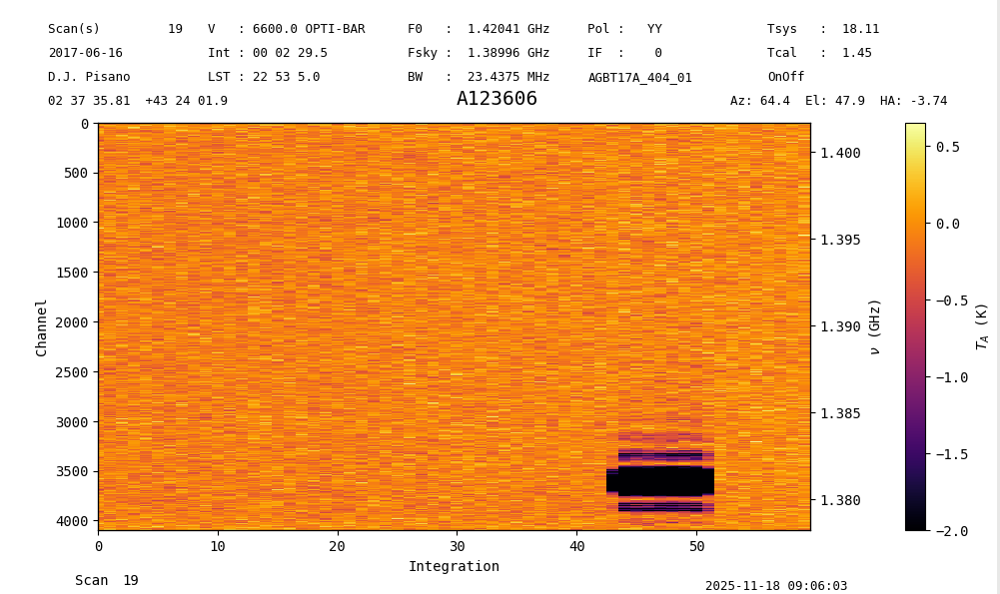
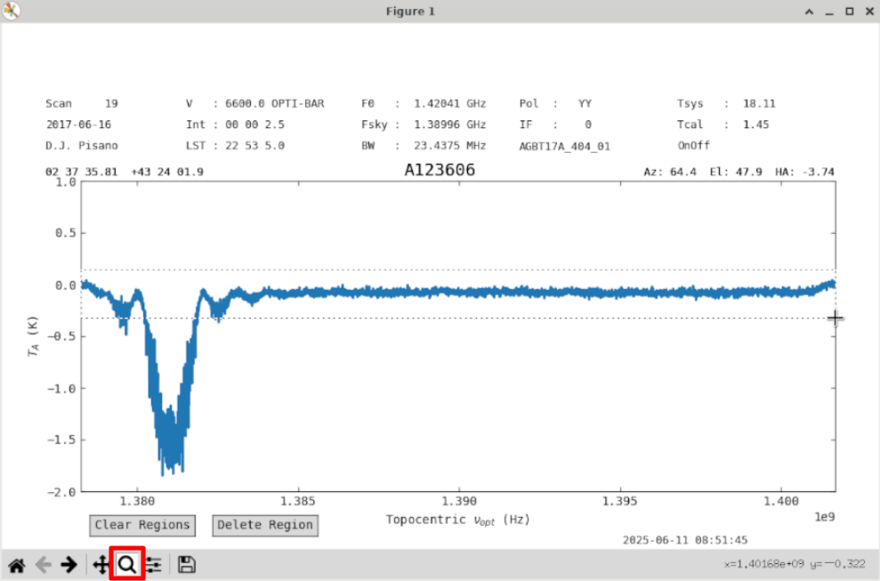
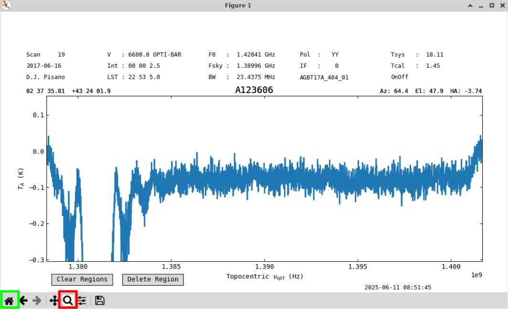
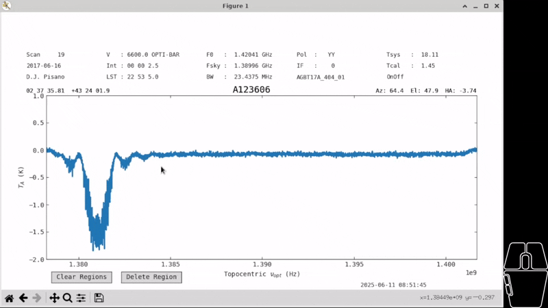
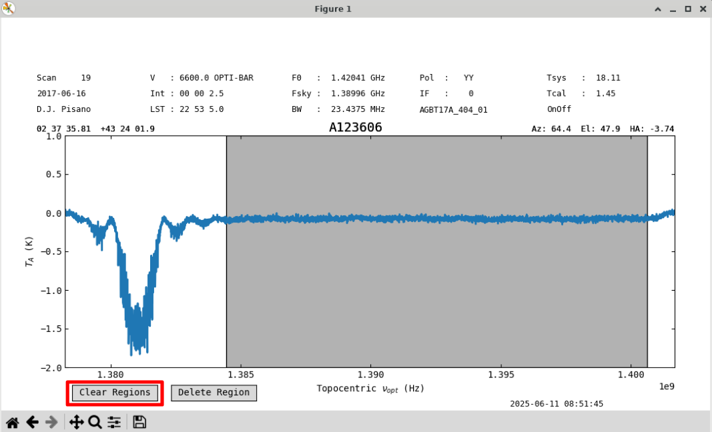
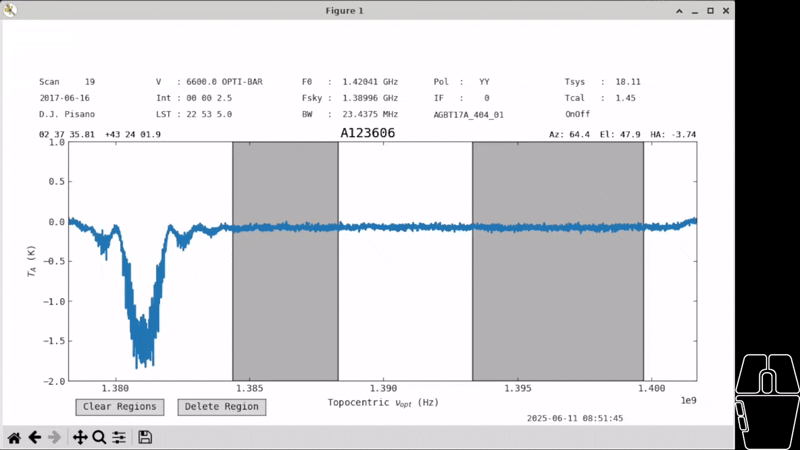
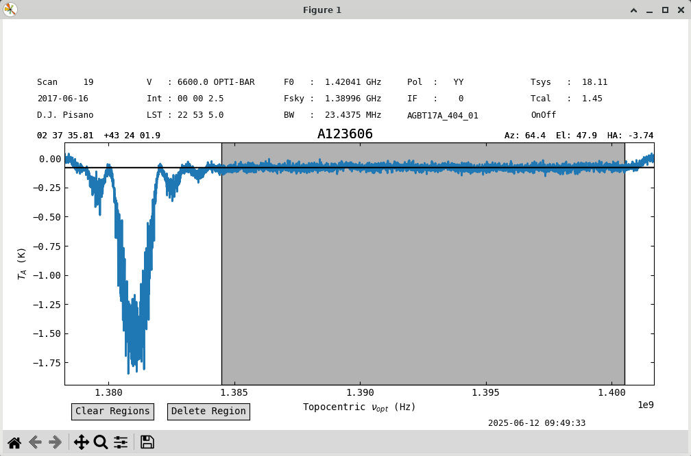
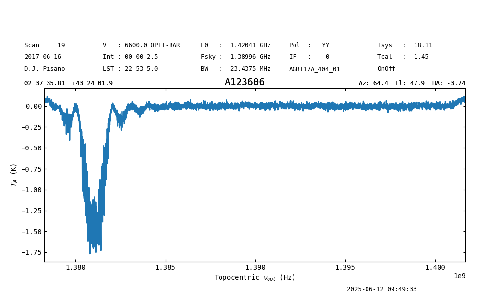
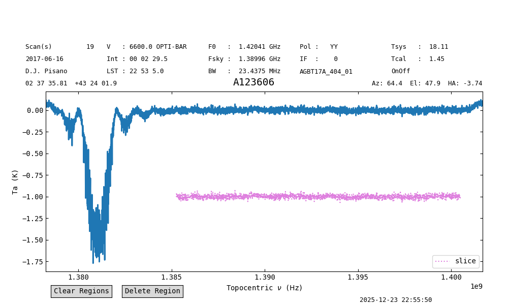
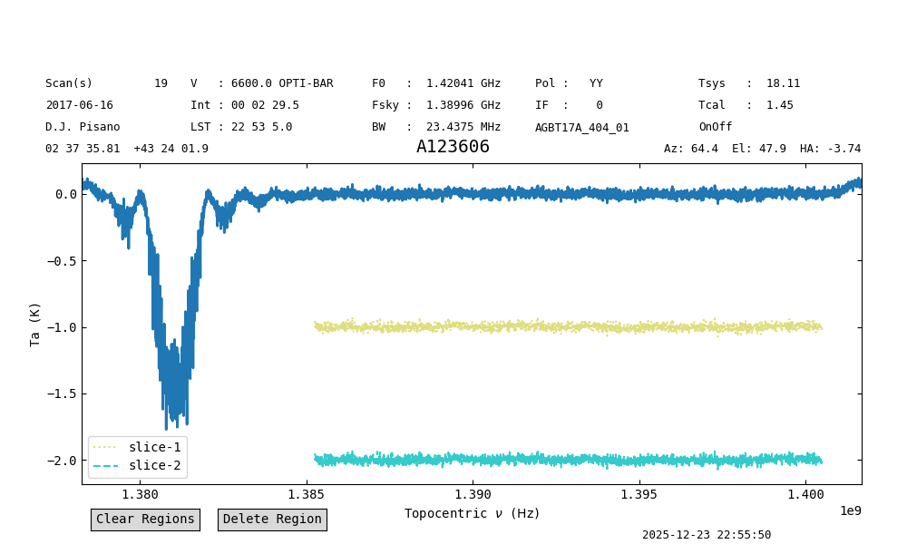

*********************************
dysh Interactive Plotter Tutorial
*********************************

In this tutorial, we will walk through the features of the interactive plotter offered by dysh.
There are two types of interactive plots: waterfall/spectrogram plots, and 1-dimensional spectrum plots.

.. _scanblock-plots:

=========================
ScanBlock Waterfall plots
=========================

In this section, we describe how to create and interact with waterfall plots.
First, we download data from an HI survey and open it with dysh.

.. code-block::

    from dysh.fits.gbtfitsload import GBTFITSLoad
    from pathlib import Path
    from dysh.util.download import from_url

.. code-block::

    url = "http://www.gb.nrao.edu/dysh/example_data/rfi-L/data/AGBT17A_404_01.raw.vegas/AGBT17A_404_01.raw.vegas.A.fits"
    savepath = Path.cwd() / "data"
    filename = from_url(url, savepath)
    sdfits = GBTFITSLoad(filename)

Now, we grab a position-switched scan with GPS interference but we don't time average it, leaving it as a full `~dysh.spectra.scan.ScanBlock` with one `~dysh.spectra.scan.PSScan`.
Waterfall plots can be created using a single `~dysh.spectra.scan.ScanBase` object or `~dysh.spectra.scan.ScanBlock` objects that contain many scans.
The process is identical.

.. code-block::

    ps = sdfits.getps(scan=19, plnum=0, fdnum=0, ifnum=0)
    psplt = ps.plot()

.. image:: files/sb_plot1.png

The return is a `~dysh.plot.scanplot.ScanPlot` object.
Since we keep a reference to the `~dysh.plot.scanplot.ScanPlot` object ``psplt``, we can do several things to change its aspects.
Let's change the lower limit of the color scale to see the clean data and the extent of the GPS RFI a little better.

.. code-block::

    psplt.set_clim(vmin=-2)

Other functions include `~dysh.plot.scanplot.ScanPlot.set_interpolation`, `~dysh.plot.scanplot.ScanPlot.set_cmap`, and `~dysh.plot.scanplot.ScanPlot.set_norm`.
All of the arguments associated with these functions can be added to the initial plot instantiation as well.
See the `matplotlib documentation <https://matplotlib.org/stable/api/_as_gen/matplotlib.pyplot.imshow.html>`_ for more details on these arguments.

You can also do waterfall plots of a `~dysh.spectra.scan.ScanBlock` with more than one scan.

.. code-block::

    tp = sdfits.gettp(scan=[19,20], plnum=0, fdnum=0, ifnum=0)
    tpplt = tp.plot(interpolation='gaussian', cmap='hot', norm='log', vmin=3e8, vmax=4e8)

Here we see clearly that the GPS RFI turns on towards the end of the second scan.
The X-axis denotes the scan number on the bottom, and the integration number along the tick marks.
The integration number resets to 0 at the beginning of each scan.

.. image:: files/sb_plot3.png

.. _spectrum-plots:

=========================
Spectrum plots
=========================

Now we turn our attention to spectrum plots.
As before, we grab some data to illustrate the functionality.

.. code-block::

    from dysh.fits.gbtfitsload import GBTFITSLoad
    from pathlib import Path
    from dysh.util.download import from_url

.. code-block::

    url = "http://www.gb.nrao.edu/dysh/example_data/rfi-L/data/AGBT17A_404_01.raw.vegas/AGBT17A_404_01.raw.vegas.A.fits"
    savepath = Path.cwd() / "data"
    filename = from_url(url, savepath)
    sdfits = GBTFITSLoad(filename)

Now grab a position-switched scan with GPS interference and time average it to get a `~dysh.spectra.spectrum.Spectrum`.
Start the interactive plotter with the `~dysh.spectra.spectrum.Spectrum.plot` function.
The return of this function is a `~dysh.plot.specplot.SpectrumPlot` object, which can be used to modify the plot.
`Spectrum.plot <dysh.spectra.spectrum.Spectrum.plot>` supports a subset of the arguments offered by `matplotlib.pyplot.plot`.
These are: ``xmin``, ``xmax``, ``ymin``, ``ymax``, ``xlabel``, ``ylabel``, ``xaxis_unit``, ``yaxis_unit``, ``label``, ``alpha``, ``figsize``, ``grid``, ``linewidth``, ``color``, and ``title``.
If you do not wish to have the interactive plotter and prefer a static plot, add ``interactive=False`` to the arguments.

.. code-block::

    ps = sdfits.getps(scan=19, plnum=0, fdnum=0, ifnum=0).timeaverage()
    ps_plot = ps.plot()

Use the zoom button (red) to zoom into the baseline.

We will use a first order baseline.
Uncheck the zoom button (red) to re-enable region selection, and go back to the original zoom level with the home button (green).

Create a region over the clean part of the spectrum by holding down left-click with your mouse and dragging across the screen.

You can clear all regions with the "Clear Regions" (red) button.

You can click on a region to select it, allowing you to drag it to a different place in the spectrum or change its size.
Currently, regions can only be resized by clicking near the edge from within the region.
Regions are allowed to overlap.
Once a region is selected its borders will turn purple, and you can delete it with the "Delete Region" button.

.. admonition:: Note

    All buttons on the plot will disappear when using the ``ps_plot.savefig()`` command.
    However, they will still remain in screenshots.

With one large region selected, we can try a baseline.
Use the ``remove=False`` option to just plot the baseline fit without removing it.

.. code-block::

    ps.baseline(1, include=ps.get_selected_regions(), remove=False)

The fit looks good.
Let's subtract it out and save the figure.
See that the buttons have disappeared.
The white space at the top is reserved for buttons that will be implemented in the future and will be addressed.
We can check the stats before and after to see they've improved.

.. code-block::

    ps.get_selected_regions()
    [(210,2871)]

    print(f"{ps[210:2871].stats()['mean']:.4f}, {ps[210:2871].stats()['rms']:.4f}")
    -0.0780 K, 0.0204 K

    ps.baseline(1,include=ps.get_selected_regions(),remove=True)

    print(f"{ps[210:2871].stats()['mean']:.4f}, {ps[210:2871].stats()['rms']:.4f}")
    -0.0000 K, 0.0204 K

    ps_plot.savefig('my_spectrum.png')

Overplotting
------------

To overplot one or more `~dysh.spectra.spectrum.Spectrum` in a plot, use the `~dysh.plot.specplot.SpectrumPlot.oshow` function.
Continuing from the example above, we will overplot a slice of the spectrum.
We select the channels used for the baseline fit, ``[(210,2871)]``, and offset the slice so it is clearly visible.
We also give it a label, ``label="slice"``, an ``alpha`` value of 0.5, a magenta color, ``color="m"``, and a dotted line style, ``linestyle=":"``.

.. code:: Python

   ps_plot.oshow(ps[210:2871]-1, label="slice", alpha=0.5, color="m", linestyle=":")

To clear the "oshows" use `~dysh.plot.specplot.SpectrumPlot.clear_overlays`:

.. code:: Python

    ps_plot.clear_overlays(oshows=True)

It is possible to overplot multiple spectra in a single call.
In this case, the arguments must be lists, with one value per spectrum being plotted.
For example:

.. code:: Python

    ps_plot.oshow([ps[210:2871]-1,
                   ps[210:2871]-2],
                  label=["slice-1", "slice-2"],
                  alpha=[0.5, 0.8],
                  color=["y", "c"],
                  linestyle=[":", "--"])

The same result can be obtained by directly using the ``oshow`` and ``oshow_kwargs`` in the call to `~dysh.spectra.spectrum.Spectrum.plot`:

.. code:: Python

    ps_plot2 = ps.plot(oshow=[ps[210:2871]-1,
                              ps[210:2871]-2],
                       oshow_kwargs={"label":["slice-1", "slice-2"],
                                     "alpha": [0.5, 0.8],
                                     "color": ["y", "c"],
                                     "linestyle": [":", "--"]}
                      )
